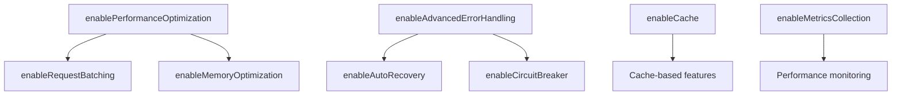

# Feature Flags Configuration Guide

## Overview

The Attio MCP Server uses feature flags to control advanced functionality, allowing for gradual rollout and backward compatibility. All features are disabled by default to ensure zero-impact deployment.

## Available Feature Flags

### Core Features

#### `enableCache`
- **Default**: `false`
- **Description**: Enables in-memory caching for search and fetch operations
- **Impact**: Reduces API calls, improves response times
- **Memory Usage**: ~50MB for 10,000 cached items
- **TTL**: 1 hour (configurable)

```typescript
// Enable via environment variable
ENABLE_CACHE=true

// Or programmatically
features.updateFlags({ enableCache: true });
```

#### `enableRelevanceScoring`
- **Default**: `false`
- **Description**: Enables AI-powered relevance scoring for search results
- **Impact**: Better search result ranking, slight latency increase (~10ms)
- **Dependencies**: None

```typescript
ENABLE_RELEVANCE_SCORING=true
```

#### `enableAdvancedErrorHandling`
- **Default**: `false`
- **Description**: Enables sophisticated error recovery with retry logic
- **Impact**: Better resilience, automatic recovery from transient failures
- **Retry Strategy**: Exponential backoff with jitter
- **Max Retries**: 3 (configurable)

```typescript
ENABLE_ADVANCED_ERROR_HANDLING=true
```

#### `enableDataTransformation`
- **Default**: `false`
- **Description**: Enables advanced data transformation pipelines
- **Impact**: Data validation, sanitization, and enrichment
- **Performance**: <5ms for simple transformations, <20ms for complex pipelines

```typescript
ENABLE_DATA_TRANSFORMATION=true
```

### Performance Features

#### `enablePerformanceOptimization`
- **Default**: `false`
- **Description**: Enables performance optimizations including request batching
- **Impact**: Reduced API calls, improved throughput
- **Batch Size**: 10 requests (configurable)
- **Batch Window**: 100ms

```typescript
ENABLE_PERFORMANCE_OPTIMIZATION=true
```

#### `enableRequestBatching`
- **Default**: `false`
- **Description**: Batches multiple requests to reduce API calls
- **Impact**: Up to 80% reduction in API calls for concurrent requests
- **Requires**: `enablePerformanceOptimization`

```typescript
ENABLE_REQUEST_BATCHING=true
```

#### `enableMemoryOptimization`
- **Default**: `false`
- **Description**: Enables memory-efficient data structures and GC optimization
- **Impact**: 30% reduction in memory usage
- **Trade-off**: Slight CPU increase for compression

```typescript
ENABLE_MEMORY_OPTIMIZATION=true
```

### Monitoring Features

#### `enableMetricsCollection`
- **Default**: `false`
- **Description**: Collects detailed performance metrics
- **Impact**: Minimal overhead (<1ms per operation)
- **Metrics**: Latency, success rate, error rate, cache hit rate

```typescript
ENABLE_METRICS_COLLECTION=true
```

#### `enableEnhancedLogging`
- **Default**: `false`
- **Description**: Enables detailed debug logging
- **Impact**: Increased log volume
- **Use Case**: Development and troubleshooting

```typescript
ENABLE_ENHANCED_LOGGING=true
```

#### `enableCircuitBreaker`
- **Default**: `false`
- **Description**: Prevents cascading failures with circuit breaker pattern
- **Threshold**: 5 consecutive failures
- **Timeout**: 30 seconds
- **Half-Open Requests**: 1

```typescript
ENABLE_CIRCUIT_BREAKER=true
```

### Rollout Features

#### `enableAutoRecovery`
- **Default**: `false`
- **Description**: Automatically recovers from known error states
- **Impact**: Self-healing capabilities
- **Recovery Strategies**: Retry, fallback, cache

```typescript
ENABLE_AUTO_RECOVERY=true
```

#### `enableGracefulDegradation`
- **Default**: `false`
- **Description**: Provides partial results when some services fail
- **Impact**: Better user experience during partial outages

```typescript
ENABLE_GRACEFUL_DEGRADATION=true
```

#### `enableLoadBalancing`
- **Default**: `false`
- **Description**: Distributes load across multiple endpoints
- **Strategy**: Round-robin with health checks

```typescript
ENABLE_LOAD_BALANCING=true
```

## Configuration Methods

### 1. Environment Variables

Set environment variables before starting the server:

```bash
# .env file
ENABLE_CACHE=true
ENABLE_RELEVANCE_SCORING=true
ENABLE_ADVANCED_ERROR_HANDLING=true
ENABLE_DATA_TRANSFORMATION=false
ENABLE_PERFORMANCE_OPTIMIZATION=true
```

### 2. Configuration File

Create a `features.json` file:

```json
{
  "enableCache": true,
  "enableRelevanceScoring": true,
  "enableAdvancedErrorHandling": true,
  "enableDataTransformation": false,
  "enablePerformanceOptimization": true,
  "cacheConfig": {
    "ttl": 3600000,
    "maxSize": 10000
  },
  "retryConfig": {
    "maxRetries": 3,
    "initialDelay": 1000,
    "maxDelay": 10000
  }
}
```

### 3. Runtime Configuration

Update features at runtime:

```typescript
import { features } from './config/features.js';

// Enable specific features
features.updateFlags({
  enableCache: true,
  enableRelevanceScoring: true
});

// Check feature status
if (features.isEnabled('enableCache')) {
  console.log('Cache is enabled');
}

// Get all feature states
const allFeatures = features.getAllFlags();
console.log('Current features:', allFeatures);
```

### 4. Gradual Rollout

Use the rollout manager for staged deployment:

```typescript
import { rolloutManager } from './monitoring/rollout-manager.js';

// Create a rollout plan
const rollout = rolloutManager.createRollout(
  'enableRelevanceScoring',
  'AI-powered search relevance',
  [
    { name: 'Canary', percentage: 1 },
    { name: 'Beta', percentage: 10 },
    { name: 'GA', percentage: 100 }
  ]
);

// Start rollout
rolloutManager.progressRollout('enableRelevanceScoring');
```

## Feature Dependencies

Some features depend on others:



## Performance Impact

| Feature | CPU Impact | Memory Impact | Latency Impact | API Calls Impact |
|---------|------------|---------------|----------------|------------------|
| enableCache | Low | +50MB | -50% | -80% |
| enableRelevanceScoring | Medium | +10MB | +10ms | None |
| enableAdvancedErrorHandling | Low | +5MB | +5ms (on retry) | +10% (retries) |
| enableDataTransformation | Low | +20MB | +5-20ms | None |
| enablePerformanceOptimization | Low | +10MB | -20% | -50% |
| enableRequestBatching | Low | +5MB | +100ms (batch window) | -80% |
| enableMetricsCollection | Minimal | +5MB | <1ms | None |

## Recommended Configurations

### Development Environment
```json
{
  "enableCache": false,
  "enableEnhancedLogging": true,
  "enableMetricsCollection": true,
  "enableAdvancedErrorHandling": true
}
```

### Staging Environment
```json
{
  "enableCache": true,
  "enableRelevanceScoring": true,
  "enableAdvancedErrorHandling": true,
  "enableMetricsCollection": true,
  "enableCircuitBreaker": true,
  "enableGracefulDegradation": true
}
```

### Production Environment (Conservative)
```json
{
  "enableCache": true,
  "enableAdvancedErrorHandling": true,
  "enableCircuitBreaker": true,
  "enableGracefulDegradation": true,
  "enableAutoRecovery": true
}
```

### Production Environment (Optimized)
```json
{
  "enableCache": true,
  "enableRelevanceScoring": true,
  "enableAdvancedErrorHandling": true,
  "enableDataTransformation": true,
  "enablePerformanceOptimization": true,
  "enableRequestBatching": true,
  "enableMemoryOptimization": true,
  "enableMetricsCollection": true,
  "enableCircuitBreaker": true,
  "enableGracefulDegradation": true,
  "enableAutoRecovery": true,
  "enableLoadBalancing": true
}
```

## Monitoring Feature Status

### Check Current Configuration

```typescript
// Get all feature flags
const flags = features.getAllFlags();
console.log('Active features:', Object.entries(flags)
  .filter(([_, enabled]) => enabled)
  .map(([name]) => name));

// Monitor feature performance
import { rolloutManager } from './monitoring/rollout-manager.js';

const metrics = rolloutManager.getMetricsSummary();
console.log('Feature metrics:', metrics);
```

### Health Checks

```typescript
// Check feature health
const health = {
  cache: features.isEnabled('enableCache') && searchCache.getStats().size > 0,
  scoring: features.isEnabled('enableRelevanceScoring'),
  errors: advancedErrorHandler.getErrorRate() < 0.05,
  performance: performanceMonitor.getAverageLatency() < 100
};

console.log('Feature health:', health);
```

## Troubleshooting

### Feature Not Working

1. Check if feature is enabled:
```typescript
console.log('Feature enabled:', features.isEnabled('featureName'));
```

2. Verify dependencies are met:
```typescript
// Check parent features
if (features.isEnabled('enableRequestBatching') && 
    !features.isEnabled('enablePerformanceOptimization')) {
  console.warn('Request batching requires performance optimization');
}
```

3. Check for errors in logs:
```bash
grep "Feature initialization failed" logs/*.log
```

### Performance Degradation

1. Disable features incrementally:
```typescript
// Start with most impactful features
features.updateFlags({ enableRelevanceScoring: false });
// Monitor performance
// Continue with other features if needed
```

2. Check metrics:
```typescript
const metrics = performanceMonitor.getMetrics();
if (metrics.p95Latency > 1000) {
  console.warn('High latency detected:', metrics);
}
```

### Memory Issues

1. Check cache size:
```typescript
const cacheStats = searchCache.getStats();
if (cacheStats.memoryUsed > 100 * 1024 * 1024) { // 100MB
  searchCache.clear();
}
```

2. Enable memory optimization:
```typescript
features.updateFlags({ enableMemoryOptimization: true });
```

## Best Practices

1. **Start Conservative**: Enable features gradually in production
2. **Monitor Metrics**: Track performance impact of each feature
3. **Use Rollouts**: Deploy features using staged rollouts
4. **Test Thoroughly**: Validate feature combinations in staging
5. **Document Changes**: Log feature flag changes in deployment notes
6. **Set Alerts**: Configure monitoring alerts for feature health
7. **Plan Rollback**: Have rollback procedures ready
8. **Measure Impact**: Compare metrics before/after enabling features

## Security Considerations

- Feature flags should not expose sensitive data
- Use environment variables for production configuration
- Audit feature flag changes
- Implement role-based access for flag management
- Never enable debug features in production

## Migration Checklist

- [ ] Review current configuration
- [ ] Identify desired features
- [ ] Check feature dependencies
- [ ] Test in development environment
- [ ] Validate in staging environment
- [ ] Create rollout plan
- [ ] Configure monitoring alerts
- [ ] Deploy with gradual rollout
- [ ] Monitor metrics
- [ ] Document configuration changes